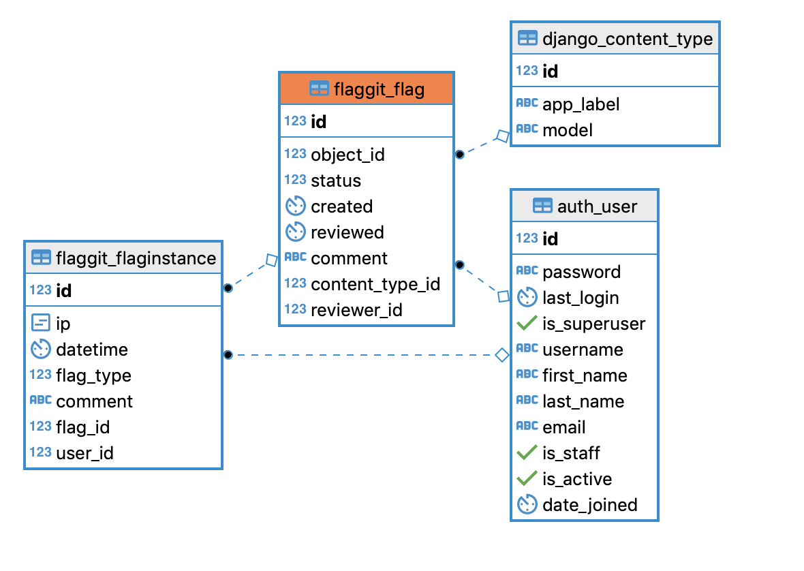

# django-flaggit

django-flaggit enables content flagging.

## Installation
Be sure to install this fork from github

    $ pipenv install -e git+https://github.com/morenoh149/django-flaggit.git#egg=django-flaggit
	
## Usage:

* Add `flaggit` to your `INSTALLED_APPS`
```
    # settings.py
    ...
    INSTALLED_APPS = (
        ...
	'flaggit',
    )
```
* run migrations
```
$ ./manage.py migrate
```
* Include `flaggit.urls` into your URLs if you plan on using the template
  tag:

		urlpatterns = patterns('',
			url('^', include('flaggit.urls')),
		)
### rest framework
In DRF you can define a custom endpoint and pass the instance to flaggit to flag. First define a serializer
```
# serializers.py
from flaggit.models import FlagInstance

class FlagInstanceSerializer(serializers.ModelSerializer):
    class Meta:
        model = FlagInstance
        fields = '__all__'
```
then define your endpoint
```
# views.py
from .serializers import FlagInstanceSerializer

SomeViewSet(viewsets.ModelViewSet):
...

    @action(detail=True, methods=['post'])
    def flag(self, request, pk=None):
        some_model = self.get_object()
        flag_instance = flaggit.utils.flag(some_model, user=request.user, ip=None, comment=None)
        serializer = FlagInstanceSerializer(data=flag_instance)
        serializer.is_valid()
        return Response(data=serializer.data)
```
After you POST to `/some-model/:id/flag` you will see new records in the admin panel.

## Test

Follow above steps and run

	python manage.py test flaggit
	

## API

### Models

* `flaggit.models.Flag` - object belongs_to a Flag. Tracks the state of review in the flagging process and what moderator reviewed the item.
* `flaggit.models.FlagInstance` - FlagInstance has_a Flag. Tracks a particular user flagging a record. If a record is flagged by many users Flag.num_flags will increment.


### Utils

* `flaggit.utils.flag(obj, user=None, ip=None, comment=None)`:  
  Flag an `obj`, returns a `FlagInstance`

### Signals

* `flaggit.signals.flagged(flag)`:  
  Sent when something is flagged. Can be used to notify moderators.

* `flaggit.signals.review(flag)`:  
  Sent when something is in review.

* `flaggit.signals.rejected(flag)`:  
  Sent when some content was rejected.

* `flaggit.signals.approved(flag)`:  
  Sent when some content was approved.

Here's a template you can copy paste:

	import flaggit

	def handle_flagged(sender, flag, created = False, **kwargs):
		if created:
			# send emails
			pass
		else:
			pass
	
	def handle_review(sender, flag, **kwargs):
		pass
		
	def handle_rejected(sender, flag, **kwargs):
		flag.content_object.delete()
		flag.delete()
	
	def handle_approved(sender, flag, **kwargs):
		pass
	
	flaggit.signals.flagged.connect(handle_flagged)
	flaggit.signals.review.connect(handle_review)
	flaggit.signals.rejected.connect(handle_rejected)
	flaggit.signals.approved.connect(handle_approved)

### Template tags

	
	
	

* ``:  
  Renders a form to flag `object`-

* ``:  
  Renders the form with a custom template.

------------- 
  
[@flashingpumpkin](http://twitter.com/flashingpumpkin)
